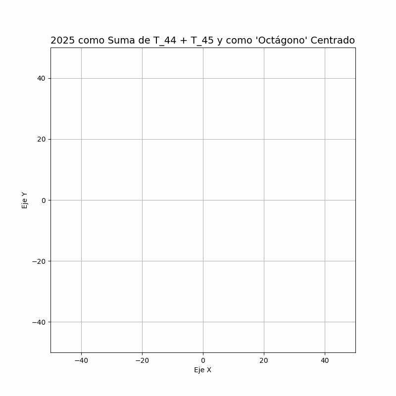

# Arte_Juegos_Matematicos



```markdown
# 📚 Matemática Recreativa

¡Bienvenido al fascinante mundo de la Matemática Recreativa! Este repositorio está diseñado para explorar una rama de las matemáticas que combina creatividad, curiosidad y diversión. Aquí encontrarás recursos teóricos, desafíos interactivos, implementaciones prácticas y actividades que transforman el aprendizaje matemático en una experiencia lúdica y estimulante. 

**¿Qué descubrirás?**  
Resolver problemas ingeniosos, entender paradojas, explorar juegos matemáticos y mucho más.

---

## 📂 Contenido del Repositorio

1. **Introducción a la Matemática Recreativa**
   - Historia y objetivos.
   - Importancia en el aprendizaje matemático.

2. **Problemas Clásicos**
   - Problemas de lógica.
   - Acertijos numéricos.
   - Juegos matemáticos.

3. **Geometría Recreativa**
   - Construcciones geométricas.
   - Exploración de polígonos y poliedros.
   - Ilusiones ópticas matemáticas.

4. **Teoría de Números**
   - Secuencias numéricas interesantes (Ejemplo: Fibonacci, números primos).
   - Criptografía recreativa.

5. **Matemática Computacional**
   - Simulaciones matemáticas con Python.
   - Algoritmos para resolver acertijos matemáticos.

6. **Paradojas Matemáticas**
   - Paradoja del mentiroso y otras paradojas lógicas (inspirado en Smullyan).
   - Paradojas de probabilidad como la paradoja de Monty Hall.
   - Paradojas geométricas (Ejemplo: Banach-Tarski).

7. **Teoría de Juegos**
   - Juegos estratégicos como el Nim y el Hackenbush (inspirados en Conway).
   - Teoría básica de juegos combinatorios.
   - Soluciones matemáticas a juegos populares como Sudoku.

8. **Autómatas Celulares**
   - **El Juego de la Vida** de Conway.
   - Aplicaciones de autómatas en simulaciones.
   - Exploración de reglas alternativas en autómatas celulares.

9. **Lógica Recreativa**
   - Acertijos de caballeros y escuderos (inspirado en Smullyan).
   - Problemas de deducción lógica.
   - Construcción de diagramas de Venn y razonamiento lógico.

10. **Fractales y Geometría de la Naturaleza**
    - Introducción a fractales (con ejemplos como el conjunto de Mandelbrot).
    - Construcción de fractales con Python.
    - Exploración de patrones geométricos en la naturaleza.

11. **Matemática y Arte**
    - Simetría y teselaciones (Ejemplo: patrones de Escher).
    - Música y matemáticas: exploración de relaciones armónicas.
    - Creación de arte generativo con algoritmos.

12. **Aritmética Recreativa**
    - Curiosidades sobre números (Ejemplo: números felices, números de Kaprekar).
    - Juegos con divisibilidad y modularidad.
    - Desafíos con números mágicos y cuadrados mágicos.

13. **Material Adicional**
    - Recursos externos, libros y herramientas útiles.

---

## 🎯 Objetivos de Aprendizaje

- Aprender matemáticas de forma interactiva y divertida.
- Desarrollar habilidades de resolución de problemas mediante acertijos.
- Aplicar conceptos matemáticos a juegos y desafíos.
- Explorar herramientas computacionales para visualizar y resolver problemas.

---

## 🌟 Ejemplos Visuales y Actividades

- **El Juego de la Vida de Conway**: Explora patrones emergentes en esta simulación matemática.
- **Construcción de un Dodecaedro Animado**: Aprende sobre geometría tridimensional con animaciones interactivas.
- **Problemas de Caminos Mínimos**: Resuelve problemas de redes con algoritmos eficientes.
- **Simulación de Fractales**: Construye el triángulo de Sierpinski o el conjunto de Mandelbrot.
- **Paradoja de Monty Hall**: Experimenta con simulaciones para entender esta famosa paradoja.

---

## ⚙️ Uso del Repositorio

Para comenzar a explorar los notebooks interactivos:

```bash
git clone https://github.com/tu_usuario/matematica_recreativa.git
cd matematica_recreativa
jupyter notebook
```

Abre el notebook de tu interés y comienza a resolver problemas o explorar visualizaciones.

---

## 💡 Ideas para Recursos

### Problemas Clásicos
- **Torre de Hanoi**: Implementación y visualización del clásico problema matemático.
- **El Problema del Caballo de Ajedrez**: Resuelve este problema de recorrido en un tablero.

### Geometría Recreativa
- **Cortes de Círculos y Polígonos**: Descubre cuántas regiones puedes crear con cortes estratégicos.

### Simulaciones
- **Juego de la Vida**: Experimenta con patrones y reglas.
- **Números Aleatorios**: Visualiza distribuciones y experimenta con probabilidades.

### Actividades Computacionales
- **Escribir Algoritmos**: Resuelve problemas como generación de números primos o problemas de mochila.
- **Visualizaciones Gráficas**: Usa bibliotecas como `matplotlib` para crear gráficos atractivos.

---

## 🤝 Colaboración

¡Las contribuciones son bienvenidas! Si tienes ideas para nuevos problemas, juegos o implementaciones, sigue estos pasos:

1. Haz un fork de este repositorio.
2. Crea una nueva rama:
   ```bash
   git checkout -b feature/nueva-caracteristica
   ```
3. Realiza tus cambios y haz commit de ellos:
   ```bash
   git commit -m 'Añadir nueva característica'
   ```
4. Haz push a la rama:
   ```bash
   git push origin feature/nueva-caracteristica
   ```
5. Abre un Pull Request para que revisemos tus cambios.

---

## 📜 Licencia

Este proyecto está bajo la licencia MIT. Consulta el archivo `LICENSE` para más detalles.

---

¡Esperamos que disfrutes este viaje por el mundo de la Matemática Recreativa! 🎉
```


```markdown
# 📚 Recreational Mathematics

Welcome to the fascinating world of Recreational Mathematics! This repository is designed to explore a branch of mathematics that combines creativity, curiosity, and fun. Here, you'll find theoretical resources, interactive challenges, practical implementations, and activities that transform mathematical learning into a playful and stimulating experience.

**What will you discover?**  
Solve ingenious problems, understand paradoxes, explore mathematical games, and much more.

---

## 📂 Repository Contents

1. **Introduction to Recreational Mathematics**
   - History and objectives.
   - Importance in mathematical learning.

2. **Classic Problems**
   - Logic puzzles.
   - Numerical riddles.
   - Mathematical games.

3. **Recreational Geometry**
   - Geometric constructions.
   - Exploration of polygons and polyhedra.
   - Mathematical optical illusions.

4. **Number Theory**
   - Fascinating numerical sequences (e.g., Fibonacci, prime numbers).
   - Recreational cryptography.

5. **Computational Mathematics**
   - Mathematical simulations with Python.
   - Algorithms for solving mathematical puzzles.

6. **Mathematical Paradoxes**
   - The liar paradox and other logical paradoxes (inspired by Smullyan).
   - Probability paradoxes like the Monty Hall problem.
   - Geometric paradoxes (e.g., Banach-Tarski).

7. **Game Theory**
   - Strategic games like Nim and Hackenbush (inspired by Conway).
   - Basics of combinatorial game theory.
   - Mathematical solutions to popular games like Sudoku.

8. **Cellular Automata**
   - **Conway's Game of Life**.
   - Applications of automata in simulations.
   - Exploring alternative rules in cellular automata.

9. **Recreational Logic**
   - Knights and knaves puzzles (inspired by Smullyan).
   - Logical deduction problems.
   - Constructing Venn diagrams and logical reasoning.

10. **Fractals and Geometry in Nature**
    - Introduction to fractals (e.g., Mandelbrot set).
    - Constructing fractals with Python.
    - Exploring geometric patterns in nature.

11. **Mathematics and Art**
    - Symmetry and tessellations (e.g., Escher patterns).
    - Music and mathematics: exploring harmonic relationships.
    - Generative art creation with algorithms.

12. **Recreational Arithmetic**
    - Curiosities about numbers (e.g., happy numbers, Kaprekar numbers).
    - Games with divisibility and modularity.
    - Challenges with magic numbers and magic squares.

13. **Additional Resources**
    - External links, books, and useful tools.

---

## 🎯 Learning Objectives

- Learn mathematics in an interactive and fun way.
- Develop problem-solving skills through puzzles.
- Apply mathematical concepts to games and challenges.
- Explore computational tools to visualize and solve problems.

---

## 🌟 Visual Examples and Activities

- **Conway's Game of Life**: Explore emerging patterns in this mathematical simulation.
- **Animated Dodecahedron Construction**: Learn about three-dimensional geometry with interactive animations.
- **Shortest Path Problems**: Solve network problems with efficient algorithms.
- **Fractal Simulations**: Construct the Sierpinski triangle or the Mandelbrot set.
- **Monty Hall Paradox**: Experiment with simulations to understand this famous paradox.

---

## ⚙️ How to Use the Repository

To start exploring the interactive notebooks:

```bash
git clone https://github.com/your_username/recreational_mathematics.git
cd recreational_mathematics
jupyter notebook
```

Open the notebook of your choice and start solving problems or exploring visualizations.

---

## 💡 Ideas for Resources

### Classic Problems
- **Tower of Hanoi**: Implementation and visualization of the classic mathematical problem.
- **The Knight's Tour Problem**: Solve this board traversal puzzle.

### Recreational Geometry
- **Circle and Polygon Cuts**: Discover how many regions you can create with strategic cuts.

### Simulations
- **Game of Life**: Experiment with patterns and rules.
- **Random Numbers**: Visualize distributions and experiment with probabilities.

### Computational Activities
- **Writing Algorithms**: Solve problems like generating prime numbers or knapsack problems.
- **Graphical Visualizations**: Use libraries like `matplotlib` to create visually appealing graphs.

---

## 🤝 Collaboration

Contributions are welcome! If you have ideas for new problems, games, or implementations, follow these steps:

1. Fork this repository.
2. Create a new branch:
   ```bash
   git checkout -b feature/new-feature
   ```
3. Make your changes and commit them:
   ```bash
   git commit -m 'Add new feature'
   ```
4. Push to the branch:
   ```bash
   git push origin feature/new-feature
   ```
5. Open a Pull Request for review.

---

## 📜 License

This project is licensed under the MIT License. See the `LICENSE` file for more details.

---

We hope you enjoy this journey into the world of Recreational Mathematics! 🎉
```

---

